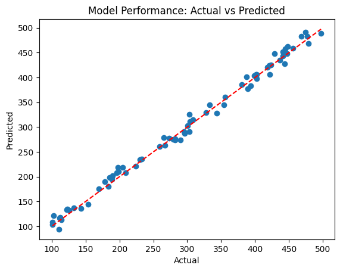

Solar Energy Data Analysis
Project Overview
This project explores the relationship between weather conditions and solar energy production. By analysing factors like Irradiance, Temperature, and Humidity, we built a predictive model to estimate solar panel efficiency.

Tech Stack
Language: Python

Libraries: Pandas, Scikit-learn, Matplotlib, Seaborn

Environment: Google Colab

Model Performance
Our predictive model was highly successful in mapping weather conditions to solar energy output.

How accurate is it?
Reliability (R² Score): 0.99
We can explain 99% of the changes in energy output using weather data. In simple terms, this means our model is incredibly consistent—it "understands" the pattern between sunlight, temperature, and electricity production almost perfectly.

Precision (RMSE): 10.25
On average, our predictions deviate from the actual energy output by only about 10 units. This level of accuracy confirms that the model is a dependable tool for forecasting.

_Technical Note: The model was built using Linear Regression, trained on a dataset covering three primary weather variables: Temperature, Irradiance, and Humidity._

Visualising the Results

*The graph above demonstrates how closely our model's predictions align with actual energy generation.*

How to Run
Access the notebook: [https://colab.research.google.com/drive/1kE3l2jKrKJSFZDlNeUNXN3UBZX71k48c#scrollTo=fUwDzVftd1Iv]

Ensure you have the required libraries installed.

Run the cells sequentially.

Blog: Bridging Renewable Data and Power Electronics
In the field of power electronics, the performance of Modular Multilevel Inverters (MMIs) is inherently linked to the stability of the DC source. As solar energy becomes a primary input, managing the volatility of weather-dependent generation is a significant challenge for grid integration.

Why this matters to Power Systems Research
For renewable energy systems to be truly effective, the inverter must adapt in real-time to the fluctuating power supplied by the panels. By building a high-accuracy predictive model (R² of 0.99), we demonstrate that environmental data can be used as a feed-forward signal in power electronics controllers. This allows for predictive adjustments in the MMI—such as optimising PWM (Pulse Width Modulation) strategies and voltage balancing—which reduces total harmonic distortion and improves the overall stability of the energy conversion process.

The Bottom Line
This project demonstrates that integrating machine learning with traditional power electronics control can transform intermittent renewable energy into a predictable, grid-ready resource. By leveraging weather-based insights, we can design more robust, adaptive energy conversion systems for the next generation of smart grids.
